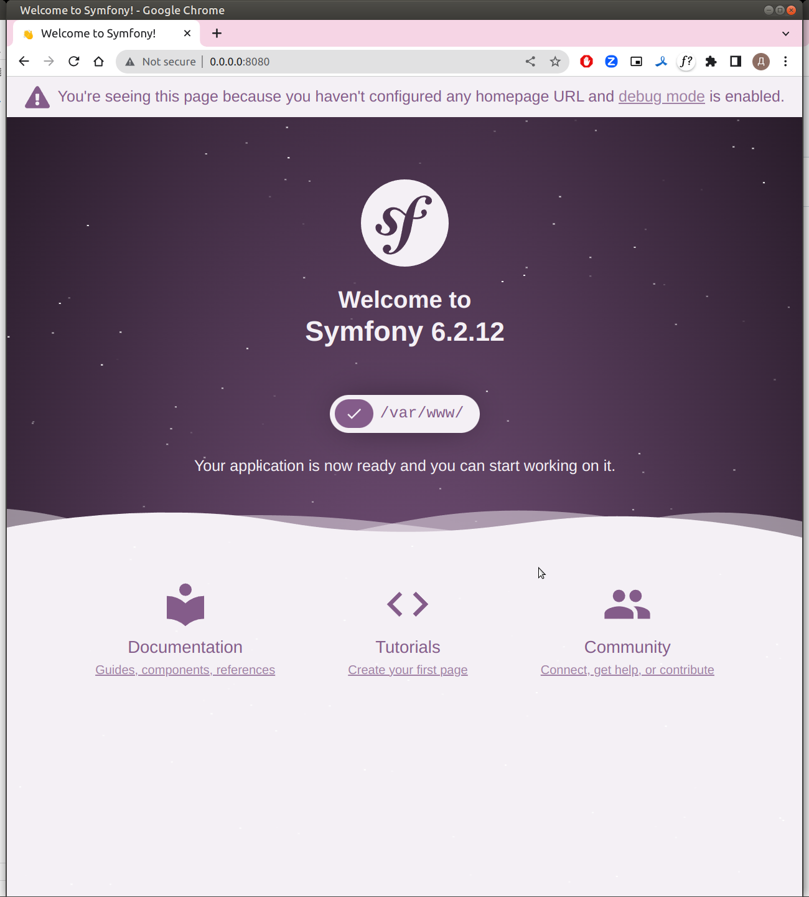

### Symfony 6 example

Это README будет пополняться в зависимости от новых branches добавляемых в репозиторий

#### Step 0

Репозиторий с уже готовой конфигурацией для быстрого старта. Для запуска выполните следеющие действия

1. Сколнируйте репозиторий себе 
```shell
git clone https://github.com/endemio/php-symfony-6-example.git php-symfony-git-test --branch step0
```
где **php-symfony-git-test** - папка, в которую хотите скопировать проект

2. Скопируйте docker-compose и env
```shell
cp docker-compose-dev.yml docker-compose.yml 
cp .env.example .env
```

3. Заполните .env
```shell
APP_ENV=dev
APP_SECRET=lubayadlinnaystroka
```
**lubayadlinnaystroka* - любая длинная строка без пробелов и специальныхз символов

4. Запускаем контейнер
```shell
docker-compose build
docker-compose run app composer install
docker-compose up -d
```

Все ОК, проверяем теперь через http://0.0.0.0:8080/. Должны увидеть что-то подобное



